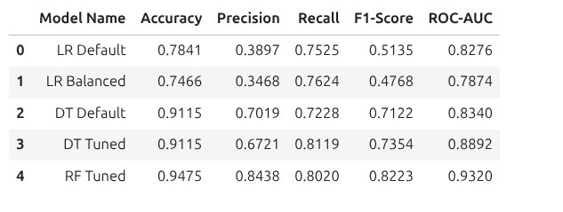
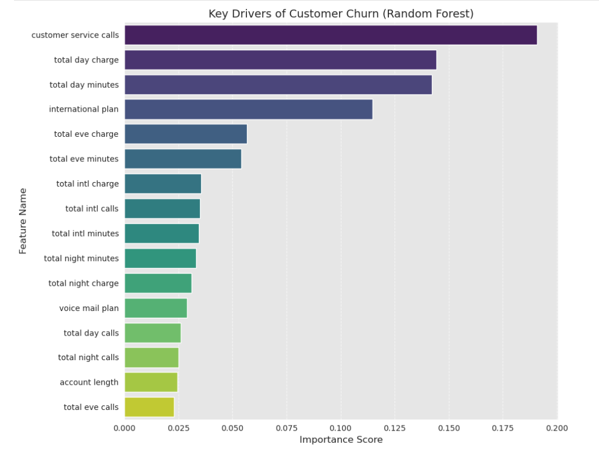

# SyriaTel Customer Churn Prediction

AUTHOR:   [Lilibeth Chepngetich Langat](mailto:beth13lilib@gmail.com)

## 1. Overview

This project develops a predictive classifier to identify customers at high risk of churning from SyriaTel, a telecommunications company. By leveraging machine learning, we move beyond simple historical observation to proactive intervention, allowing the business to anticipate customer departure and implement retention strategies that protect revenue streams.

## 2. Business and Data Understanding

**Stakeholder Audience:** Marketing & Retention Teams require lists of "at-risk" individuals for targeted campaigns.

**Executive Leadership:** Seek to understand high-level drivers of customer churn to inform pricing and service policy.

**Data Choice:** The dataset contains customer activity records, including call usage, service interactions, and subscription plans.

* **Key Features:** Our analysis identified **International Plan**, **Customer Service Calls**, **Total Day Minutes**, and **Total Day Charge** as the primary drivers of churn.
* **Data Preparation:** The [Syriatel_dataset](https://www.kaggle.com/datasets/becksddf/churn-in-telecoms-dataset) contained no missing values. We optimized the feature set by dropping redundant variables and low-impact features (such as state) that introduced noise without improving predictive power.

## 3. Modeling

### Rationale: Why Machine Learning?

While traditional data analysis can identify that "high-usage customers churn," it struggles to account for the complex, non-linear interactions between multiple variables simultaneously. Machine learning allows us to assign a specific probability of churn to every individual customer by weighing all features together—something simple statistical averages cannot achieve.

### Model Iteration & Reasoning

1. **Baseline (Logistic Regression):** We began with a distance-based model to establish a benchmark. To ensure accuracy, we applied **StandardScaling**, fitting the scaler *only* on the training data to prevent data leakage. While useful, this linear model struggled with the non-linear "breaking points" in customer behavior (e.g., the sudden spike in churn after exactly 3 service calls).
2. **Refinement (Decision Tree):** We shifted to a tree-based model to better capture these thresholds. We utilized `class_weight='balanced'` to ensure the model did not ignore the minority churn class.
3. **Final Selection (Random Forest):** The Random Forest was chosen as the best-suited model. By aggregating an ensemble of trees, it reduces the "variance" (overfitting) seen in a single Decision Tree, resulting in a model that generalizes much better to new, unseen customers.

## 4. Evaluation



We evaluated our final model using metrics that balance technical precision with business cost-efficiency.

### Classification Metrics (Random Forest)

* **Accuracy:** 94.7%
* **Precision:** 84.4%
* **Recall:** 80.2%
* **F1-Score:** 82.2%
* **ROC-AUC:** 0.932

### Data Science & Business Rationale

* **Why F1-Score?** Because churners are the minority, "Accuracy" can be misleading. We prioritized the **F1-Score** to ensure we reached a harmonic balance between catching churners and maintaining precision.
* **Why ROC-AUC?** This measures the model's ability to rank customers correctly by risk. A score of 0.932 indicates an exceptional ability to separate loyal customers from churners across all possible thresholds.
* **Real-World Implication:** With **84.4% Precision**, SyriaTel avoids "False Alarms", ensuring that expensive retention discounts are not wasted on customers who had no intention of leaving. With **80.2% Recall**, we successfully capture 4 out of 5 potential leavers before they exit.

## 5. Limitations

* **Historical Bias:** The model relies on accumulated usage data. It is significantly less accurate for "New Customers" (0–1 months) who have not yet established a behavioral footprint.
* **Unseen Market Shifters:** The model cannot account for external factors like a competitor launching a major promotion. In production, such "external shocks" could lead to a sudden spike in churn that the model would not predict based on internal data alone.
* **Feature Dependency:** The high importance of `total_day_charge` means the model is highly sensitive to pricing. If SyriaTel changes its base rates, the model must be retrained immediately, or it will produce inaccurate "ghost" triggers.

## 6. Recommendations



Based on the model's findings, we recommend the following strategic actions:

* **The "Call-Limit" Protocol:** Since the model shows churn risk spikes after 3 calls, stakeholders should implement a mandatory "Senior Resolution" workflow for any customer reaching their 3rd support interaction. This proactively addresses the `customer_service_calls` trigger.
* **Day-Usage Incentives:** Marketing should target high-usage customers (those with high `total_day_minutes`) with "Unlimited Day" bundles or flat-rate upgrades to decouple high usage from high churn risk.
* **International Plan Audit:** The high correlation between the **International Plan** and churn suggests a value-gap. Stakeholders should consider bundling inclusive international data or minutes to make the plan more "sticky."
* **Deployment:** Integrate the Random Forest probability scores into the CRM. Customers with a probability score > 0.70 should be automatically flagged for a 3-month loyalty bonus offer.

**Data Integrity:** To prevent **Data Leakage**, all preprocessing (Scaling and Feature Selection) was fitted exclusively on the training set. The test data remained "unseen" until the final evaluation to ensure the metrics reported above realistically represent performance on future SyriaTel customers.

## For more Information
See the full analysis in the [Jupyter notebook](Churn.ipynb) or review this  [presentation](Churn_presentation.pdf)

For more information, contact me at  [Lilibeth Chepngetich Langat](mailto:beth13lilib@gmail.com)

# Repository Structure
```python
├── Data
├── Images
├── README.md
├── Churn_presentation.pdf
└── Churn.ipynb
```